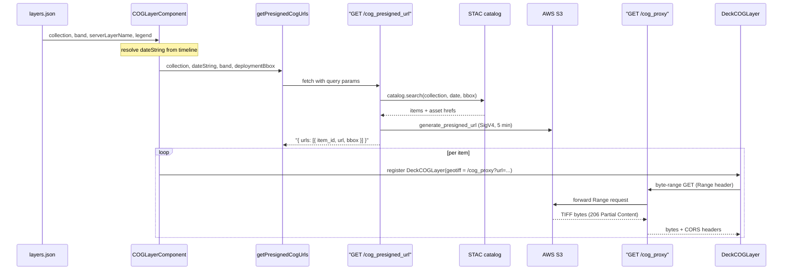

# COG layers

How PRISM renders **COG (Cloud Optimized GeoTIFF)** layers: how they differ from WMS, the request/render pipeline, projection handling, and the API endpoints involved.

For user-facing configuration, see the `cog` section in the main [README](../README.md). For the date model (reference date, validity, query date), see [dates.md](dates.md).

## What a COG layer is

A COG layer streams a Cloud Optimized GeoTIFF directly from a [STAC](https://stacspec.org/) catalog and renders it **client-side** with [deck.gl](https://deck.gl/). No map server rasterizes the data into images; the browser fetches the bytes it needs (HTTP byte-range requests) and colorizes the pixels on the GPU.

| Concern | WMS layer | COG layer |
| --- | --- | --- |
| Rendering | Map server returns PNG/JPEG tiles | Browser reads GeoTIFF bytes, colorizes on GPU |
| Map technology | MapLibre raster `Source` + `Layer` | deck.gl `COGLayer` via `MapboxOverlay` (interleaved) |
| Color ramp | Baked into server-side style | Built from the layer `legend` on the client |
| Reprojection | Server-side | Client-side (any source CRS → web mercator) |
| Data discovery | WMS `GetMap` | STAC search → presigned S3 URL |
| CORS | Server sets headers | Proxied through the API (`/cog_proxy`) |

COG layers are designed to **behave like WMS layers** in the UI (date selection, opacity, mutual exclusivity, render below admin boundaries) by reusing the existing WMS machinery — see [UI parity](#ui-parity-with-wms).

## Configuration

COG layers are defined in the shared or per-country `layers.json` with `type: "cog"` (see the README for a full example). The TypeScript shape is `CogLayerProps` in [`frontend/src/config/types.ts`](../frontend/src/config/types.ts):

```ts
export class CogLayerProps extends CommonLayerProps {
  type: 'cog' = 'cog';
  collection: string;       // STAC collection ID, used for /cog_presigned_url
  serverLayerName: string;  // WMS layer name, used only for date discovery
  band?: string;            // STAC asset key when items have multiple assets
  wcsConfig?: { scale?: number; offset?: number };
  // title, legend, legendText required; chartData, startDate optional
}
```

The split between `collection` and `serverLayerName` is the key design decision: **dates come from WMS GetCapabilities (keyed by `serverLayerName`), pixels come from STAC (keyed by `collection`)**. They are usually identical, but keeping both lets a COG layer reuse the WMS date pipeline unchanged.

## End-to-end data flow



1. **Resolve the date** — [`COGLayerComponent`](../frontend/src/components/MapView/Layers/COGLayer/index.tsx) uses the same date hooks as WMS (`useDefaultDate`, `getRequestDate`). Available dates are stored under the **layer `id`** (`mapServerDatesToLayerIds` in [`server-utils.ts`](../frontend/src/utils/server-utils.ts)), so the component reads `serverAvailableDates[id]`.
2. **Fetch presigned URLs** — [`getPresignedCogUrls`](../frontend/src/components/MapView/Layers/raster-utils.ts) calls `GET /cog_presigned_url` with `collection`, `date`, `band`, and the deployment `bbox` (`appConfig.map.boundingBox`) to spatially filter tiled collections to roughly the deployment region.
3. **Register deck.gl layers** — each returned item becomes a `DeckCOGLayer` whose `geotiff` URL points at the **proxy** (`/cog_proxy?url=...`), not S3 directly. Layers are registered into a shared registry ([`DeckGLLayersContext`](../frontend/src/components/MapView/DeckGLLayersContext.tsx)) and pushed to a single `MapboxOverlay` ([`DeckGLOverlay`](../frontend/src/components/MapView/DeckGLOverlay.tsx)) created with `interleaved: true`, so deck.gl shares MapLibre's WebGL context and honors `beforeId` ordering.

Each STAC item is rendered as an individual `DeckCOGLayer` rather than a `MosaicLayer` (see [projection handling](#projection--crs-handling)).

## Projection / CRS handling

COG source files are frequently **not** in web mercator — for example MODIS products use a sinusoidal grid (`ESRI:54008`). WMS layers sidestep this because the tile server reprojects before sending images; COG layers must reproject on the client.

`@developmentseed/deck.gl-geotiff`'s `COGLayer` does this for us:

1. It reads the GeoTIFF's embedded CRS (`geotiff.crs`), either a numeric EPSG code or a WKT string.
2. A numeric code is resolved to a projection definition via the default `epsgResolver`, which fetches PROJJSON from `https://epsg.io/{code}.json` and caches it in a module-level `PROJECTION_REGISTRY`; WKT is parsed locally.
3. It builds `proj4` converters from the source CRS to both `EPSG:4326` and `EPSG:3857`, then reprojects the raster as a refined mesh (`@developmentseed/raster-reproject`) into web mercator for display.

This is what lets PRISM display sinusoidal MODIS COGs (and any other CRS) directly, without a server-side warp step. Two consequences to keep in mind:

- **Network dependency**: resolving a numeric EPSG code hits `epsg.io` at runtime (once per code, then cached). For offline or locked-down deployments, pass a custom `epsgResolver` / preload `PROJECTION_REGISTRY` instead of relying on the default.
- **STAC bbox units**: `item.bbox` for tiled MODIS collections is in **sinusoidal meters, not WGS84**. That is why we render per-item `DeckCOGLayer`s rather than a `MosaicLayer` (which needs WGS84 bboxes for viewport culling). Server-side `bbox` filtering already limits results to a handful of tiles, so culling is unnecessary. To re-enable `MosaicLayer` later, convert the bbox to WGS84 on the API with pyproj (`Transformer.from_crs("ESRI:54008", "EPSG:4326")`) — see the comment in `COGLayer/index.tsx`.

## Rendering pipeline

Pixel values become colors entirely on the GPU using `@developmentseed/deck.gl-raster` modules (in `createTileHandlers`):

1. **`getTileData`** — fetch a tile, convert the integer raster to `Float32` applying `wcsConfig.scale`, upload it as an `r32float` texture. The legend is baked into a 256×1 RGBA colormap texture on first tile load (`buildColormapImageData`).
2. **`renderTile`** — assemble the render modules: `CreateTexture` (bind tile) → `FilterNoDataVal` (discard scaled `nodata`) → `LinearRescale` (`[0, maxValue]`, from the last legend value) → `Colormap` (sample the legend texture).

`nodata` is read from GeoTIFF metadata in `onGeoTIFFLoad` and kept in a ref so the render closure always sees the current value.

## API endpoints

Both endpoints live in [`api/prism_app/main.py`](../api/prism_app/main.py); STAC + presign logic is in [`api/prism_app/presigned_cog_url.py`](../api/prism_app/presigned_cog_url.py). Frontend base URLs are in [`frontend/src/utils/constants.ts`](../frontend/src/utils/constants.ts).

### `GET /cog_presigned_url`

Params: `collection` (required), `date`, `band`, `bbox` (`minLon,minLat,maxLon,maxLat`). Searches the STAC catalog, resolves the asset href per item (requested `band` first, else first asset), and returns SigV4 presigned URLs: `{ "urls": [{ "item_id", "url", "bbox" }] }`.

- Presign lifetime 300s; results cached 240s (`TTLCache`) to stay under expiry.
- Region is discovered from the `x-amz-bucket-region` header (no `s3:GetBucketLocation` needed), `lru_cache`d. Credentials from `STAC_AWS_ACCESS_KEY_ID` / `STAC_AWS_SECRET_ACCESS_KEY`.
- The boto3 client sets `ignore_configured_endpoint_urls=True` so a local `AWS_ENDPOINT_URL` (e.g. RustFS/MinIO) doesn't hijack presigning toward the local store (regression test: `test_presign_ignores_rustfs_endpoint_env`).

### `GET /cog_proxy`

WFP S3 buckets don't emit CORS headers, so the browser can't read them directly. `/cog_proxy?url=<presigned>` forwards the request server-side (preserving the `Range` header) and streams the response back with CORS headers from `CORSMiddleware`. The target host must match the S3 virtual-hosted allowlist regex (prevents open-proxy abuse); only a small set of content headers are forwarded; `200`/`206` pass through, anything else becomes `502`.

## UI parity with WMS

COG layers reuse WMS plumbing wherever possible:

- **Dates / timeline** — `cog` is included in WMS date preloading (`preloadLayerDatesForWMS`), treated as `'WMSLayer'` by `getLayerType`, listed in `dateSupportLayerTypes`, handled by `isDateCompatibleLayer`, and has a `case 'cog'` in `getPossibleDatesForLayer`. This makes the `DateSelector` appear for COG layers.
- **Mutual exclusivity** — `keepLayer` ([`keep-layer-utils.ts`](../frontend/src/utils/keep-layer-utils.ts)) treats `wms` and `cog` as one raster-hazard class (`RASTER_HAZARD_TYPES`), so turning on a COG removes any active WMS/COG layer and vice versa.
- **Z-order** — `cog` shares ordering rank `7` with `wms` ([`mapStateSlice`](../frontend/src/context/mapStateSlice/index.ts)) and is not in `LAYERS_ABOVE_BOUNDARIES`, so it anchors below admin boundaries via the `before`/`beforeId` chain.
- **Opacity** — opacity state is shared with WMS ([`opacityStateSlice.ts`](../frontend/src/context/opacityStateSlice.ts)). The MapLibre `setPaintProperty` path is a no-op for COG; effective opacity is read from Redux and passed to `DeckCOGLayer`.
- **Data loading** — COG is excluded from the Redux `loadLayerData` thunk; the component self-fetches presigned URLs.

## Adding a new COG layer

1. Confirm the data exists as a COG in the STAC catalog; note its **collection ID** and **band/asset key**.
2. Add a `type: "cog"` entry to `layers.json` with `collection`, `server_layer_name`, `legend`, `legend_text`, and (if needed) `band` and `wcsConfig`. Set `validity` / `date_interval` as for the equivalent WMS layer.
3. Reference the layer ID from the relevant category in `prism.json`.
4. Verify: the timeline appears, the layer renders below boundaries, opacity drags smoothly, and switching to a WMS layer removes the COG (and vice versa).
