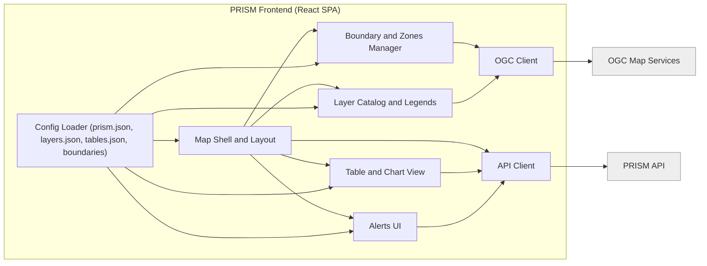
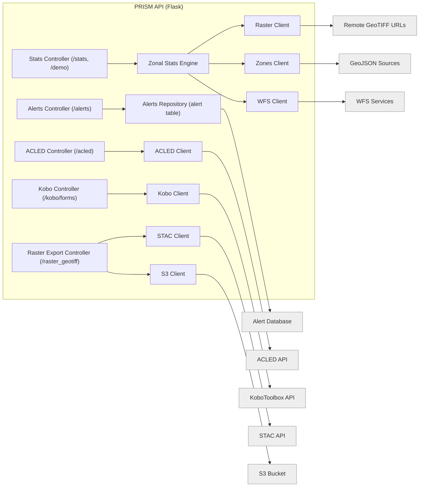

# PRISM Architecture

Repository-based Technical Overview

This document provides a clean, accurate architecture description of the PRISM application. It is intended for developers, maintainers, and technical reviewers.

PRISM consists of two main runtime components:

* A **config-driven frontend** for geospatial visualization and interaction

* A **lightweight backend API** for zonal statistics, alert management, data integration, and raster exports

Additional supporting packages exist for shared code and alerting.

---

## 1. Repository Structure

```
prism-app/
├── frontend/         # React-based web application (SPA)
├── api/              # Flask API for stats, alerts, Kobo, ACLED, STAC exports
├── alerting/         # Alert processing (via docker-compose)
├── common/           # Shared utilities and types
├── docs/             # Documentation
└── docker-compose.*  # Deployment definitions
```

---

## 2. System Overview

PRISM is a web-based geospatial system consisting of:

- A **frontend**: configurable React SPA for geospatial visualization.
- A **backend API**: lightweight Flask service providing:
  - Zonal statistics
  - Alert CRUD operations
  - KoboToolbox data access
  - ACLED conflict data
  - Raster export using STAC + S3

External systems provide:
- OGC map services (WMS/WMTS/WFS)
- Remote raster/vector files
- STAC API
- S3 for export output
- ACLED and Kobo APIs
- External alert database

---

## 3. System Context (C4 Level 1)

```mermaid
flowchart LR

    user[User (Analyst / Operator)]
    user --> FE[PRISM Frontend (React SPA)]

    FE --> API[PRISM API]

    FE --> OGC[OGC Map Services]

    API --> DB[(Alert Database)]
    API --> S3[(S3 Bucket for Raster Exports)]
    API --> STAC[STAC API]
    API --> ACLED[ACLED API]
    API --> KOBO[KoboToolbox API]

    classDef ext fill:#eeeeee,stroke:#999999;
    class OGC,DB,S3,STAC,ACLED,KOBO ext;
```

---

## 4. Container View (C4 Level 2)

### 4.1 Frontend

- Static React SPA
- Loads configs and static data
- Displays layers from OGC map services
- Calls backend API for:
  - Stats
  - Alerts
  - Kobo
  - ACLED
  - Raster exports

### 4.2 Backend API

- Flask service
- Implements:
  - `/stats`
  - `/alerts`, `/alerts-all`
  - `/acled`
  - `/kobo/forms`
  - `/raster_geotiff`
- Uses external:
  - STAC API
  - S3
  - ACLED API
  - KoboToolbox API
  - Alert DB

### 4.3 Supporting Modules

- `alerting/`: alert execution logic
- `common/`: shared utilities

---

## 5. Frontend Component Diagram (C4 Level 3)



---

## 6. API Component Diagram (C4 Level 3)



---

## 7. Deployment Overview

As documented:

- Traefik proxy on EC2
- Docker Compose deployment
- Environment variables stored in AWS Secrets Manager
- EC2 with IAM role for S3 access

Common operational issues and fixes are documented in `api/README.md`.

---

## 8. Summary

The system is modular, configurable, and suitable for deployment across WFP and partner infrastructures with these key elements:

- React frontend  
- Flask API backend  
- Modular alerting  
- External OGC, STAC, S3, ACLED, Kobo integrations  