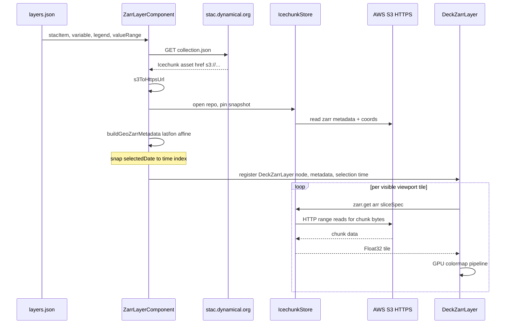

# Zarr layers (dynamical.org)

How PRISM renders **Zarr** layers from [dynamical.org](https://dynamical.org/) Icechunk repositories: how they differ from WMS and COG, the request/render pipeline, GeoZarr metadata synthesis, and configuration.

For user-facing configuration, see the `zarr` section in the main [README](../README.md). For the date model (reference date, validity, query date), see [dates.md](dates.md). For the shared GPU colormap pipeline used by both COG and Zarr layers, see [cog-layers.md](cog-layers.md#rendering-pipeline).

## What a Zarr layer is

A Zarr layer streams a cloud-optimized Zarr dataset from dynamical.org's [STAC catalog](https://stac.dynamical.org/catalog.json) and renders it **client-side** with [deck.gl](https://deck.gl/). The browser opens an [Icechunk](https://icechunk.io/) repository directly (via `icechunk-js` + `zarrita`), fetches only the Zarr chunks that intersect the **current map viewport**, and colorizes pixels on the GPU.

| Concern | WMS layer | COG layer | Zarr layer |
| --- | --- | --- | --- |
| Rendering | Map server returns PNG/JPEG tiles | Browser reads GeoTIFF bytes, colorizes on GPU | Browser reads Zarr chunks, colorizes on GPU |
| Map technology | MapLibre raster `Source` + `Layer` | deck.gl `COGLayer` | deck.gl `ZarrLayer` |
| Color ramp | Baked into server-side style | Built from layer `legend` on client | Same as COG (shared GPU pipeline) |
| Spatial coverage | Server tiles | Presigned URLs filtered to deployment `bbox` | **Live viewport** (pan/zoom loads new chunks) |
| Data discovery | WMS GetCapabilities | STAC → `/cog_presigned_url` API | STAC collection → Icechunk asset href |
| PRISM API | Optional | Required (`/cog_presigned_url`, `/cog_proxy`) | **None** — browser reads S3 over HTTPS |
| Date source | WMS / WCS server | WMS GetCapabilities (same as WMS name) | STAC temporal extent (daily timeline) |

Zarr layers are designed to **behave like WMS/COG layers** in the UI (date selection, opacity, mutual exclusivity, render below admin boundaries). See [UI parity](#ui-parity-with-wms-and-cog).

Currently only the **`dynamical` subtype** is implemented: plain CF-style global grids (`time × latitude × longitude`) hosted as Icechunk v2 repositories on AWS Open Data.

## Configuration

Zarr layers are defined in per-country or shared `layers.json` with `type: "zarr"` and `subtype: "dynamical"`. The TypeScript shape is `ZarrLayerProps` in [`frontend/src/config/types.ts`](../frontend/src/config/types.ts):

```ts
export class ZarrLayerProps extends CommonLayerProps {
  type: 'zarr' = 'zarr';
  subtype: 'dynamical' = 'dynamical';
  stacItem: string;           // dynamical STAC collection URL
  variable: string;           // Zarr array name, e.g. temperature_2m
  repoUrl?: string;           // optional override; normally resolved from STAC
  valueRange?: [number, number];  // GPU rescale min/max (defaults from legend)
  colormap?: string;          // reserved / documentation; ramp comes from legend
  units?: string;
  attribution?: string;
  // title, legend, legendText required
}
```

Multiple layer entries can share the same `stac_item` (same Icechunk repo) with different `variable` names — for example several GFS analysis fields all point at `noaa-gfs-analysis`.

## End-to-end data flow



1. **Resolve STAC** — [`fetchDynamicalStacMetadata`](../frontend/src/components/MapView/Layers/ZarrLayer/stac.ts) fetches the collection document, finds the `icechunk` (or "Icechunk v2 repository") asset, and converts `s3://` hrefs to anonymous HTTPS URLs (`https://{bucket}.s3.us-west-2.amazonaws.com/{prefix}/`).
2. **Open dataset** — [`openZarrDataset`](../frontend/src/components/MapView/Layers/ZarrLayer/icechunk-store.ts) opens the repo with `icechunk-js`, pins a snapshot, reads variable metadata and `time` / `latitude` / `longitude` coordinate arrays, and caches per `(repoUrl, variable)`.
3. **GeoZarr shim** — [`buildGeoZarrMetadata`](../frontend/src/components/MapView/Layers/ZarrLayer/geozarr-shim.ts) synthesizes `spatial:*` and `proj:code` attrs that dynamical's plain CF cubes lack, validated with `@developmentseed/geozarr`'s `parseGeoZarrMetadata`.
4. **Time selection** — the selected timeline date is snapped to the nearest index in the `time` coordinate array ([`snapToNearestTimeIndex`](../frontend/src/components/MapView/Layers/ZarrLayer/georef.ts)) and passed to deck.gl as `selection: { time: index }`.
5. **Register deck.gl layer** — a single `DeckZarrLayer` is registered in [`DeckGLLayersContext`](../frontend/src/components/MapView/DeckGLLayersContext.tsx) and rendered via [`DeckGLOverlay`](../frontend/src/components/MapView/DeckGLOverlay.tsx) (`interleaved: true`, `beforeId` for z-order).

Unlike COG layers, there is **no presign or proxy step** — the Icechunk store reads S3 directly from the browser. dynamical.org buckets are on AWS Open Data and expose CORS for anonymous reads.

## Viewport tiling

`@developmentseed/deck.gl-zarr`'s `ZarrLayer` extends `RasterTileLayer`: it pairs the Zarr **native chunk grid** with deck.gl's tile layer so only chunks intersecting the **current deck viewport** are requested. Panning and zooming fetch new chunks; coverage is not limited to `appConfig.map.boundingBox` (unlike COG presign filtering).

For each visible tile the layer builds a `sliceSpec` (spatial dims bounded to the tile, `time` pinned from `selection`) and calls the app's `getTileData`, which runs `zarr.get(arr, sliceSpec)`.

## GeoZarr metadata shim

dynamical.org GFS analysis cubes are plain CF Zarr (`time`, `latitude`, `longitude` coordinate arrays) without GeoZarr convention attributes. deck.gl-zarr requires GeoZarr metadata to derive the tile pyramid, affine transform, and CRS.

The shim ([`geozarr-shim.ts`](../frontend/src/components/MapView/Layers/ZarrLayer/geozarr-shim.ts)) computes:

- **`spatial:dimensions`** — full dim list, e.g. `["time", "latitude", "longitude"]`
- **`spatial:transform`** — 6-parameter affine from lon/lat coordinate spacing (GFS: 0.25° grid, north-first latitude)
- **`spatial:shape`** — `[721, 1440]` (height × width)
- **`proj:code`** — `EPSG:4326`

These attrs are passed to `DeckZarrLayer` via the `metadata` prop (not written back to the store). If dynamical changes storage layout or adds native GeoZarr attrs, update this single module.

## Rendering pipeline

Pixel values become colors on the GPU using the same shared modules as COG layers ([`raster-gpu-pipeline.ts`](../frontend/src/components/MapView/Layers/raster-gpu-pipeline.ts) + [`raster-colormap.ts`](../frontend/src/components/MapView/Layers/raster-colormap.ts)):

1. **`getTileData`** (Zarr-specific) — `zarr.get` → coerce to `Float32`, apply CF `scale_factor` / `add_offset` → upload as `r32float` texture via `createLegendGpuPipeline().uploadTile`.
2. **`renderTile`** (shared) — `CreateTexture` → optional `FilterNoDataVal` (scaled `_FillValue`) → `LinearRescale` (`valueRange` or legend bounds) → `Colormap` (256×1 legend texture).

When the time index changes, the component re-registers the layer with `updateTriggers` on `getTileData` / `renderTile` so cached tiles are invalidated.

## Date discovery

Zarr layers do **not** use WMS GetCapabilities. Available dates are built from the STAC collection's temporal extent:

- [`getAvailableDatesForLayer`](../frontend/src/utils/server-utils.ts) calls `fetchDynamicalStacMetadata` and [`generateDailyDatesFromExtent`](../frontend/src/components/MapView/Layers/ZarrLayer/stac.ts) to produce one `DateItem` per UTC day from `extent.temporal.interval[0]` through the collection end (or today if open-ended).
- Dates are fetched **lazily** when a Zarr layer is activated (not during the WMS preload pass at app startup).

Set `date_interval`, `validity`, and related fields in `layers.json` the same as for other dated layers if you need dekad-style validity windows.

## dynamical.org STAC catalog

Browse collections at [stac.dynamical.org/catalog.json](https://stac.dynamical.org/catalog.json). Each collection document includes:

- **`cube:variables`** — variable names, units, and dimension layout
- **`cube:dimensions`** — spatial and temporal extents
- **`assets.icechunk`** — S3 URI for the Icechunk v2 repository

**Currently supported in PRISM:** collections with a single **`time`** dimension and **`latitude` / `longitude`** as the trailing spatial axes (e.g. [NOAA GFS analysis](https://stac.dynamical.org/noaa-gfs-analysis/collection.json)). Variables on the same collection share one repo URL — add separate `layers.json` entries per `variable`.

**Not yet supported:** forecast collections that use `init_time` + `lead_time` instead of `time` (e.g. GFS/GEFS forecast), regional-only grids without changes to the time-dimension resolver, and derived quantities requiring U/V wind combination.

## UI parity with WMS and COG

- **Dates / timeline** — `zarr` is in `dateSupportLayerTypes`, handled by `isDateCompatibleLayer`, and has a `case 'zarr'` in `getPossibleDatesForLayer` / `getAvailableDatesForLayer`.
- **Mutual exclusivity** — `keepLayer` treats `wms`, `cog`, and `zarr` as one raster-hazard class (`RASTER_HAZARD_TYPES`).
- **Z-order** — `zarr` shares ordering rank `7` with `wms` and `cog` in [`mapStateSlice`](../frontend/src/context/mapStateSlice/index.ts); renders below admin boundaries via `beforeId`.
- **Opacity** — same Redux opacity path as COG/WMS; passed to `DeckZarrLayer`.
- **Data loading** — excluded from the Redux `loadLayerData` thunk; the component self-fetches STAC + opens Icechunk.

## Adding a new dynamical Zarr layer

1. **Explore STAC** — open [stac.dynamical.org](https://stac.dynamical.org/catalog.json), pick a collection, and note the **`variable`** name from `cube:variables` (must use a `time × latitude × longitude` layout for now).
2. **Add legend** — define breakpoints in [`frontend/src/config/shared/legends.json`](../frontend/src/config/shared/legends.json) (or inline in `layers.json`). Set `value_range` to match the GPU rescale domain (display units after any CF scaling).
3. **Add layer entry** — in `layers.json`:

```json
"dynamical_gfs_rh": {
  "title": "Relative humidity 2m (GFS analysis, dynamical.org)",
  "type": "zarr",
  "subtype": "dynamical",
  "stac_item": "https://stac.dynamical.org/noaa-gfs-analysis/collection.json",
  "variable": "relative_humidity_2m",
  "value_range": [0, 100],
  "units": "%",
  "legend": "dynamical_rh",
  "legend_text": "2m relative humidity (%). Source: dynamical.org, CC-BY-4.0",
  "attribution": "NOAA NWS NCEP GFS data processed by dynamical.org (CC-BY-4.0)",
  "opacity": 0.75
}
```

4. **Wire the menu** — reference the layer ID under a category in `prism.json` (e.g. `nwp.dynamical`).
5. **Verify** — timeline appears with daily dates; layer covers the **visible map** (not just the deployment bbox); pan/zoom loads new tiles; date scrubbing updates the field; switching to WMS/COG removes the Zarr layer.

## Key source files

| File | Role |
| --- | --- |
| [`ZarrLayer/index.tsx`](../frontend/src/components/MapView/Layers/ZarrLayer/index.tsx) | React component: STAC resolve → open dataset → register `DeckZarrLayer` |
| [`ZarrLayer/stac.ts`](../frontend/src/components/MapView/Layers/ZarrLayer/stac.ts) | STAC fetch, Icechunk href resolution, S3→HTTPS, daily date generation |
| [`ZarrLayer/icechunk-store.ts`](../frontend/src/components/MapView/Layers/ZarrLayer/icechunk-store.ts) | Open/pin Icechunk repo, read coords and variable metadata |
| [`ZarrLayer/geozarr-shim.ts`](../frontend/src/components/MapView/Layers/ZarrLayer/geozarr-shim.ts) | Synthesize GeoZarr attrs for CF-style cubes |
| [`ZarrLayer/tile-handlers.ts`](../frontend/src/components/MapView/Layers/ZarrLayer/tile-handlers.ts) | Zarr-specific `getTileData`; delegates GPU path to shared pipeline |
| [`raster-gpu-pipeline.ts`](../frontend/src/components/MapView/Layers/raster-gpu-pipeline.ts) | Shared legend colormap + `renderTile` (also used by COG) |

## Dependencies

Frontend packages (see [`frontend/package.json`](../frontend/package.json)):

- `@developmentseed/deck.gl-zarr` — viewport-tiled Zarr rendering
- `@developmentseed/geozarr` — GeoZarr metadata parsing
- `@developmentseed/deck.gl-raster` — GPU colormap modules
- `icechunk-js` — Icechunk v2 store for `zarrita`
- `zarrita` — Zarr v3 reads
